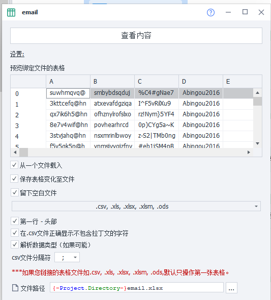
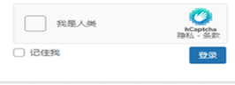
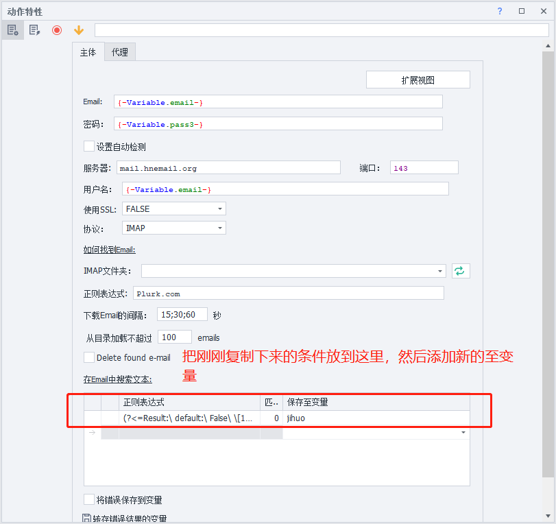

##  zp**常用的功能模块使用介绍：**


## 个人配置模块

```shell
# 个人配置模块：这个zp软件自带的一个信息模块，里面已经随机生成了姓与名，地址，城市，邮箱，密码等信息
```


## 文件模块

```shell
# 文件模块：是用来连接你本地创建的txt文件，并且来实现把你所获取的数据内容写入到你创建的txt文件，不仅仅只有写入的功能，也可以删除或者复制你txt文件的里的内容。
```


## 短信服务模块

```shell
# 短信服务模块：在一个网站上注册一个新用户时，可能需要用到电话号码来接码才能完成注册，所以就需要用到这模块，其使用方法是通过该模块提供的接码平台获取该平台的api来进行接码
```


## 数据库模块

```shell
# 数据库模块：通过该模块去获取本地数据库里的数据或者去获取他人的数据库里的数据
```


## 随机模块

```shell
# 随机模块：提供数字还有文本、用户名的随机数至变量
# 随机用户名或者密码都可以使用
```


## 文本处理模块

```shell
# 文本处理模块：给你的文本或者变量进行处理
# 添加变量【只能用英文】
```


```

```shell
# Regex：正则切割，需要去学正则的使用方法
```


```shell
# 子字符串：理解为在一串数字或者文本里去获取我们想要的数据，例：1000123571111这串数字，我们想要的是10001，就可以用这个功能，注意：10001对应的位置是01234的位置.
```


## 添加表单功能

```shell
#添加表单功能：就是连接到你本地创建好的xlsx表格并能获取到表格里的数据
```


```shell
# 连接到表格后会显示内容
```



## 设置模块

```shell
# 设置模块：里面包含了很多功能，例如清除缓存，清除cookiesden，设置触屏模式等，目前讲常用的功能
#设置代理ip：
Socks5格式的：SOCKS5://用户名:密码@IP:端口
http格式：http://用户名:密码@IP:端口
```


## 控制标签模块

```shell
# 控制标签模块：可以理解为切换，关闭，新建页面的功能，相当于你打开了很多网页，你要在网页中进行切换，关闭，新建。
```


## 保存cookiesden模块

```shell
# 保存cookiesden模块：就是保存你在该网页登录账号时保存的缓存，下次使用该cookiesden进入网页时就直接是你上次登录的账号，好处就是在频繁登录同一个账号时不会被验证。
# 第一个时导入cookie，
# 第二个导出cookie，
# 第三个分割cookie
```


## 插件模块

```shell
# 插件模块：在一些需求时，可能需要一些插件才能去完成，所以该模块就是去添加插件并激活，功能如图字面意思
# 注意事项：在使用增加插件的功能时需要有插件的密钥文件，也就是后缀名为crx的文件
# 每次添加插件，都需要去激活才能使用 【激活需要选择名字和输入插件名字】
```


###  添加插件


###  激活插件


##  载入页面模块

```shell
# 载入页面模块：放入你需要访问的网址连接比如：www.baidu.com
```


## 赋值模块

```shell
# 赋值模块：理解为在你指定的位置输入内容
```


```shell
# Set：理解为输入内容的选项
# Get:这个选项是获取的意思
# Ries：理解为模拟你鼠标的点击【这里常用的有点击和触摸模式】
```


###   Set


### Ries的点击模式


### Ries的触摸模式

```shell
# 触摸模式添加两个{设置功能的触摸屏}后可以自动启动和关闭
```


### Get


##  验证码模块

```shell
# 有3个常用的验证码，只不过对应不同验证码时得选相对的验证码模块【每个都需要到相对应的平台充值，填入代码才能使用】
```


### 第一种是需要输入到指定位置的验证码【需要去获取指定位置的属性和值，然后放入他的至变量】


### 第二种只需要选择充值好平台就可以自动识别


###  第三种和第二种一样只需要选择充值好平台就可以自动识别



##  邮箱接收模块

```shell
# 注意：使用这个功能之前，我们的邮箱必须是开通了IMAP协议的！
# 这个功能主要是有些网址在注册用户时，这个注册网址会提供一条连接或者一串数字，和一串字母到你注册的邮箱上进行一个确认，因此你需要用到该模块去获取到注册网址发给你的连接或者数字。
# 链接模式，是需要另外添加一个{载入页面}然后放入自己创建的至变量去打开我们想要的链接
# 需要输入数字或者英文的验证码，是需要到指定的位置获取到我们需要的赋值，然后用{赋值}这个功能添加我们自己创建好的至变量，才能输入到指定的位置内
```


```

###  获取链接


###  获取数字或者字母

```ABAP
# 注意；在上面的办法没办法找到我们想要链接情况下，以下的办法也可以用来获取链接
```





